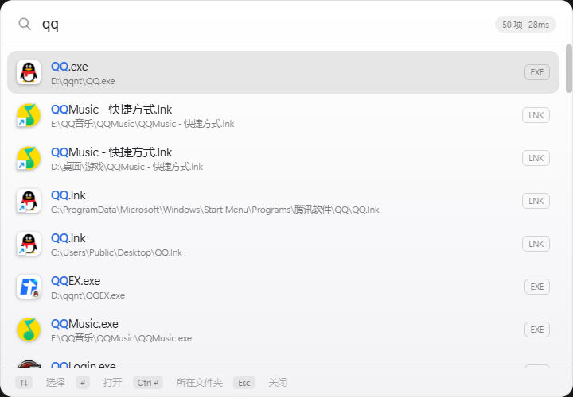

# Launcher · 毫秒级全盘文件启动器

一个 Listary / macOS Spotlight 风格的 Windows 桌面文件启动器。双击 `Ctrl`（或自定义快捷键）呼出，输入即搜，全盘几百万文件毫秒级返回。




## 特性

- **毫秒级全盘搜索** — NTFS 直读 MFT（主文件表）建立内存索引，实测 338 万条目查询 P99 < 5ms
- **实时更新** — USN Journal 变更日志监听，新建/删除/重命名的文件几秒内可搜
- **中文拼音搜索** — 全拼（`weixin` → 微信）与首字母（`wx` → 微信、`ys` → 原神）
- **英文缩写匹配** — `pcl` → Plain Craft Launcher
- **多关键词搜索** — 空格分隔多词 AND 匹配（`vs 2022`、`微信 安装`）
- **最近使用** — 呼出后空白态直接列出最近打开的文件，回车直达
- **智能排序** — 程序（exe/lnk）优先、开始菜单快捷方式提权、中文名提权、使用频次加权
- **真实应用图标** — exe / lnk 提取应用自身图标（微信、QQ 等图标直接显示）
- **右键快捷菜单** — 打开 / 所在文件夹 / 复制路径 / 复制文件 / 在 cmd、PowerShell 中打开（含管理员）/ 以管理员身份运行 / 打开方式 / 属性
- **快照秒启** — 索引原子落盘，重启后快照恢复 + USN 增量续传，无需全量重建
- **多主题** — 跟随 Windows 深浅色 / 手动深色 / 浅色
- **可配置呼出快捷键** — 双击 Ctrl / Alt+空格 / 任意自定义组合（低级键盘钩子实现，可接管系统组合键）
- **非管理员可用** — 无提权时自动降级为目录遍历索引（无实时更新）

## 使用

| 操作 | 说明 |
| --- | --- |
| `双击 Ctrl` / 自定义快捷键 | 呼出 / 收起 |
| 输入 | 即时搜索 |
| `↑` `↓` | 选择结果 |
| `Enter` | 打开 |
| `Ctrl + Enter` | 在资源管理器中定位 |
| 鼠标点击 | 打开 |
| 右键点击结果 | 快捷菜单（终端打开 / 管理员运行 / 复制文件 / 属性等） |
| `Esc` | 收起 |
| 失焦 | 自动收起 |

托盘右键 → **设置**：开机自启、呼出快捷键、主题、磁盘启用/禁用、排除目录。

## 构建

```bash
# 前端依赖
npm install

# 开发模式（需管理员权限的终端以启用 MFT）
npm run tauri dev

# 打包 NSIS 安装程序（产物在 target/release/bundle/nsis/）
npm run tauri build
```

> 提示：以管理员身份运行才能使用 MFT + USN 实时索引；普通权限自动降级为目录遍历模式（状态栏会显示当前模式）。

## 技术栈

- **Rust** + **Tauri 2**（WebView2 前端宿主）
- **searchcore** 自研索引引擎：MFT 直读（`FSCTL_ENUM_USN_DATA`）、USN Journal（`FSCTL_READ_USN_JOURNAL`）、rayon 并行扫描、Top-K 堆归并、拼音池
- **TypeScript** + Vite 前端

### 项目结构

```
crates/searchcore     # 索引与搜索引擎（MFT / USN / 快照 / 匹配器）
src-tauri             # Tauri 壳（热键 / 托盘 / 设置 / IPC 命令）
src                   # 前端（搜索 UI / 设置页 / 主题）
```

## License

MIT
